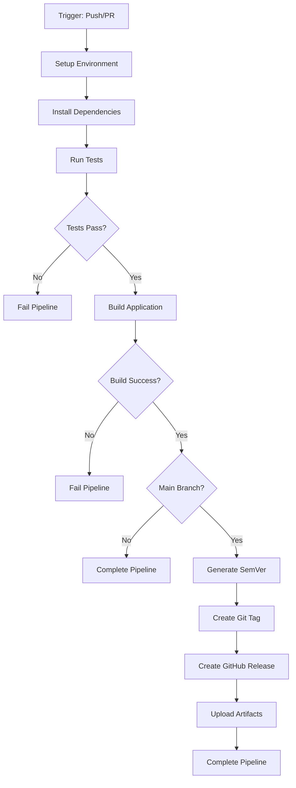

# CI Pipeline Design Document

## Overview

This design document outlines the implementation of a GitHub Actions CI pipeline for the AudioCap macOS application. The pipeline will provide automated testing, building, and release management with semantic versioning for the main branch. The solution leverages GitHub's macOS runners with Xcode support to ensure proper compilation and testing of the Swift/SwiftUI application.

## Architecture

### Pipeline Workflow Structure

The CI pipeline follows a sequential workflow with conditional branching:



### Runner Configuration

- **Runner Type**: `macos-14` (Apple Silicon support)
- **Xcode Version**: Explicitly set to ensure consistency
- **Environment**: Clean macOS environment with required development tools

## Components and Interfaces

### 1. Workflow Trigger Configuration

**File**: `.github/workflows/ci.yml`

**Triggers**:
- Push events to all branches
- Pull request events (opened, synchronize, reopened)

**Permissions**:
- `contents: write` (for creating releases and tags)
- `actions: read` (for workflow execution)

### 2. Environment Setup Component

**Responsibilities**:
- Configure macOS runner with appropriate Xcode version
- Set up environment variables for testing
- Prepare build environment

**Implementation Details**:
- Use `maxim-lobanov/setup-xcode@v1` action for Xcode version management
- Set `DEVELOPER_DIR` environment variable
- Configure test environment variables (`AUDIOCAP_TEST_MODE`, `AUDIOCAP_MOCK_AUDIO`)

### 3. Testing Component

**Test Execution Strategy**:
- Run all test suites using `xcodebuild test`
- Use the `AudioCap` scheme for comprehensive testing
- Include both unit tests (`AudioCapTests`) and UI tests (`AudioCapUITests`)

**Command Structure**:
```bash
xcodebuild test \
  -project AudioCap.xcodeproj \
  -scheme AudioCap \
  -destination 'platform=macOS' \
  -enableCodeCoverage YES
```

**Error Handling**:
- Capture test results and logs
- Fail pipeline on any test failures
- Provide detailed error reporting

### 4. Build Component

**Build Strategy**:
- Execute only after successful tests
- Use Release configuration for production-ready builds
- Generate application bundle for distribution

**Command Structure**:
```bash
xcodebuild build \
  -project AudioCap.xcodeproj \
  -scheme AudioCap \
  -configuration Release \
  -destination 'platform=macOS'
```

**Artifact Generation**:
- Create distributable `.app` bundle
- Prepare artifacts for potential release attachment

### 5. Semantic Versioning Component

**Integration**: `lukaszraczylo/semver-generator@v1`

**Configuration**:
- Analyze commit messages for version bumping
- Generate semantic version tags
- Support conventional commit patterns

**Conditional Execution**:
- Only execute on main branch
- Require successful build completion

### 6. Release Management Component

**Release Creation**:
- Use generated semantic version for tagging
- Create GitHub release with generated tag
- Include release notes based on commits

**Artifact Attachment**:
- Attach built application bundle to release
- Provide downloadable distribution package

## Data Models

### Workflow Context Data

```yaml
# Environment Variables
XCODE_VERSION: "15.4"
DEVELOPER_DIR: "/Applications/Xcode_15.4.app/Contents/Developer"
AUDIOCAP_TEST_MODE: "1"
AUDIOCAP_MOCK_AUDIO: "1"

# Build Outputs
BUILD_PATH: "build/Release/AudioCap.app"
ARCHIVE_PATH: "AudioCap.xcarchive"

# Version Information
SEMVER_VERSION: "1.2.3"
GIT_TAG: "v1.2.3"
RELEASE_NAME: "AudioCap v1.2.3"
```

### Artifact Structure

```
Release Artifacts:
├── AudioCap.app/          # Main application bundle
├── AudioCap.zip           # Compressed application for distribution
└── build-logs.txt         # Build information and logs
```

## Error Handling

### Test Failure Handling

- **Detection**: Monitor `xcodebuild test` exit codes
- **Response**: Fail pipeline immediately, prevent build execution
- **Logging**: Capture and display test failure details
- **Notification**: Provide clear feedback in GitHub UI

### Build Failure Handling

- **Detection**: Monitor `xcodebuild build` exit codes
- **Response**: Fail pipeline, prevent release steps
- **Logging**: Capture compilation errors and warnings
- **Recovery**: Provide actionable error messages

### Release Failure Handling

- **Semantic Version Generation**: Handle cases where version cannot be determined
- **Tag Creation**: Handle duplicate tag scenarios
- **Release Creation**: Handle GitHub API failures
- **Artifact Upload**: Handle file upload failures

### Environment Failures

- **Xcode Setup**: Fallback to default Xcode if specific version unavailable
- **Runner Issues**: Clear error messages for infrastructure problems
- **Permission Issues**: Validate GitHub token permissions

## Testing Strategy

### Pipeline Testing Approach

1. **Unit Testing**: Validate individual workflow steps
2. **Integration Testing**: Test complete pipeline flow
3. **Branch Testing**: Verify conditional logic for main vs. feature branches
4. **Failure Testing**: Ensure proper error handling and reporting

### Test Scenarios

- **Happy Path**: Successful test → build → release flow
- **Test Failures**: Pipeline stops at test stage
- **Build Failures**: Pipeline stops at build stage
- **Version Conflicts**: Handle existing tags gracefully
- **Permission Issues**: Clear error messages for access problems

### Validation Criteria

- All existing tests must pass in CI environment
- Build produces valid macOS application bundle
- Semantic versioning generates appropriate version numbers
- Releases are created with correct artifacts attached
- Error conditions provide actionable feedback

## Implementation Considerations

### Security

- Use GitHub secrets for sensitive configuration
- Minimize required permissions
- Validate all external action dependencies

### Performance

- Optimize build times through appropriate caching strategies
- Use parallel execution where possible
- Minimize redundant operations

### Maintainability

- Clear, documented workflow configuration
- Modular step organization
- Version pinning for external actions

### Compatibility

- Support for macOS 14.4+ deployment target
- Xcode version compatibility with project requirements
- GitHub Actions runner image compatibility