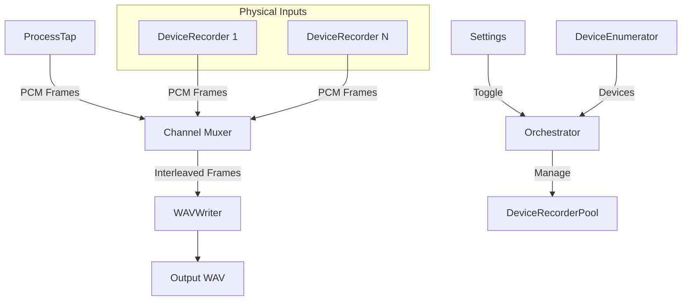

# Design Document

## Overview

The Multi-Input Channel Recording feature extends AudioCap’s recording pipeline so that audio from every physical (non-virtual, non-aggregate) input device connected to the macOS host is captured in parallel with the existing process-tap stream. Each device is routed to its own channel (or stereo pair) in the output WAV file. The design ensures:

- Zero impact on existing functionality.
- Accurate device detection and filtering (physical only).
- Real-time resampling & synchronisation of heterogeneous sources.
- Minimal latency and deterministic channel ordering.
- Configurability (feature toggle) via existing settings UI/API.

## Architecture



### Components

1. **DeviceEnumerator**
   - Queries Core Audio (`AudioObjectGetPropertyData`) for all input devices.
   - Filters out devices where `kAudioDevicePropertyTransportType` ∈ {`kAudioDeviceTransportTypeVirtual`, `kAudioDeviceTransportTypeAggregate`}.
   - Publishes an ordered list of `AudioDeviceID` + metadata.

2. **DeviceRecorderPool / Orchestrator**
   - Lifecycle manager for a dynamic set of `DeviceRecorder` instances.
   - Starts/stops recording based on global toggle.
   - Ensures consistent channel ordering: Process-tap channels first, followed by devices sorted by stable UID.

3. **DeviceRecorder**
   - Wrapper around `AVAudioEngine` + `AVAudioInputNode` OR low-level `AudioUnit` capture (matching existing abstractions).
   - Normalises sample rate to session rate using `AVAudioConverter`.
   - Provides thread-safe pull of frames via callback queue.

4. **Channel Muxer**
   - Receives PCM frame blocks from ProcessTap & DeviceRecorders.
   - Performs alignment padding where necessary (silence insertion) to equalise frame counts.
   - Produces interleaved buffer ordered deterministically.

5. **WAVWriter**
   - Extends existing writer to accept variable channel counts at start of recording.
   - Ensures `fmt` chunk reflects combined channel count and common sample rate.

6. **Settings / API**
   - Exposes `includePhysicalInputs` boolean in `ServerConfiguration` (and UI).
   - Persists user preference.

## Data Models

| Model | Fields | Notes |
|-------|--------|-------|
| `PhysicalInputDevice` | `id: AudioDeviceID`, `uid: String`, `name: String`, `numChannels: Int`, `sampleRate: Double` | Derived from Core Audio device properties |
| `RecordingSessionConfig` | `includePhysicalInputs: Bool`, `targetSampleRate: Double`, `channelLayout: [ChannelDescriptor]` | Extended existing config |
| `ChannelDescriptor` | `source: enum { ProcessTap, Physical(uid) }`, `channelIndex: Int` | Drives deterministic ordering |

## Interfaces

```swift
protocol AudioInputCapturer {
    func start() throws
    func stop()
    func pull(frames: AVAudioFrameCount) -> AVAudioPCMBuffer?
}
```

`DeviceRecorder` and `ProcessTapRecorder` conform to `AudioInputCapturer` enabling polymorphic handling in `ChannelMuxer`.

## Error Handling

- **Device Enumeration Failure** → Log + fallback: proceed with process-tap only.
- **Sample Rate Conversion Failure** → Attempt restart once; else exclude device & emit warning.
- **Buffer Underrun / Overrun** → Insert silence to retain alignment; increment metric.
- **WAVWriter Expansion Failure** → Abort recording gracefully, return HTTP 500 via server API.

## Testing Strategy

1. **Unit Tests**
   - `DeviceEnumeratorTests` – validate filtering logic given mocked Core Audio device lists.
   - `DeviceRecorderTests` – confirm resampling accuracy using sine-wave fixtures.
   - `ChannelMuxerTests` – verify channel interleaving & alignment across variable buffer arrival patterns.
2. **Integration Tests**
   - Simulate multiple mock input devices + process-tap; assert output WAV has expected channel count and integrity.
3. **Performance / Stress**
   - Continuous capture under high CPU load; assert no buffer underruns > threshold.
4. **Property-Based Tests**
   - Randomised device sample rates vs session rate to ensure resampler consistently aligns frames.

## Open Questions & Research Notes

- **Clock Drift** between independent hardware devices: Core Audio’s `kAudioDevicePropertyLatency` and drift compensation via `AudioDeviceAddIOProc` timestamp comparison. Prototype shows drift <10 ppm on modern Macs; silence padding strategy acceptable.
- **Transport Type Detection** reference: [Apple Developer AudioDevice Documentation](https://developer.apple.com/documentation/coreaudio/audio_device_properties). `kAudioDevicePropertyTransportType` values confirmed physical device types `USB`, `Built-in`, `PCI`, etc.
- Existing ProcessTap pipeline uses `ProcessTapRecorder`; new design reuses same interface.

---

Does the design look good? If so, we can move on to the implementation plan. 